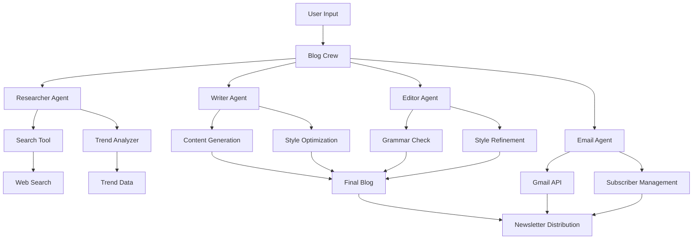

# 🤖 AI-Powered Newsletter Blog Writer

<div align="center">
  
  
  
  
</div>

## 📝 Overview

An intelligent blog writing and newsletter distribution system that leverages multiple AI agents to create, refine, and distribute engaging content. The system automates the entire process from research to distribution, making it perfect for content creators, marketers, and newsletter publishers.

## 🎥 Demo Video

[

*Click the image above to watch the demo video*

## 🏗️ System Architecture



## 🚀 Features

### 🤖 AI Agents
- **Researcher Agent**
  - Web search and information gathering
  - Trend analysis and topic relevance
  - Source validation and fact-checking
  - Content structure planning

- **Writer Agent**
  - Engaging content generation
  - SEO optimization
  - Style and tone consistency
  - Keyword integration

- **Editor Agent**
  - Grammar and spelling check
  - Style refinement
  - Readability optimization
  - Content flow improvement

- **Email Agent**
  - Subscriber list management
  - Email template customization
  - Scheduling and automation
  - Analytics tracking

### 🛠️ Tools
- **Search Tool**: Advanced web search capabilities
- **Trend Analyzer**: Real-time trend analysis
- **Email Tool**: Gmail API integration

## 🛠️ Installation

1. **Clone the Repository**
   ```bash
   git clone https://github.com/SriHarshitha88/research-blog-writer.git
   cd research-blog-writer
   ```

2. **Create Virtual Environment**
   ```bash
   python -m venv venv
   source venv/bin/activate  # On Windows: venv\Scripts\activate
   ```

3. **Install Dependencies**
   ```bash
   pip install -r requirements.txt
   ```

## 🔧 Configuration

### Google Cloud Console Setup
1. Visit [Google Cloud Console](https://console.cloud.google.com/)
2. Create a new project
3. Enable the Gmail API
4. Create OAuth 2.0 credentials
5. Download credentials as `credentials.json`

### First-time Setup
1. Place `credentials.json` in the project root
2. Run the application
3. Complete the OAuth authentication
4. Save the generated `token.pickle`

## 💻 Usage

### Starting the Application
```bash
streamlit run streamlit_app.py
```

### Creating a Blog Post
1. Enter topic/keywords
2. Specify target audience
3. Set content preferences
4. Review generated content
5. Make edits if needed
6. Send to subscribers

## 📊 Project Structure
```
research-blog-writer/
├── agents/
│   ├── researcher_agent.py    # Research and analysis
│   ├── writer_agent.py        # Content generation
│   ├── editor_agent.py        # Content refinement
│   └── email_agent.py         # Newsletter distribution
├── tools/
│   ├── search_tool.py         # Web search functionality
│   ├── trend_analyzer.py      # Trend analysis
│   └── email_tool.py          # Email operations
├── crew/
│   └── blog_crew.py           # Agent orchestration
├── streamlit_app.py           # Web interface
├── requirements.txt           # Dependencies
└── README.md                  # Documentation
```

## 🔒 Security

- Never commit sensitive files:
  - `credentials.json`
  - `token.pickle`
  - `.env` files
- Use environment variables for API keys
- Regularly rotate credentials
- Monitor API usage

## 🤝 Contributing

1. Fork the repository
2. Create a feature branch
3. Commit your changes
4. Push to the branch
5. Create a Pull Request

### Development Guidelines
- Follow PEP 8 style guide
- Add tests for new features
- Update documentation
- Maintain code quality

## 📝 License

This project is licensed under the MIT License - see the [LICENSE](LICENSE) file for details.

## 🙏 Acknowledgments

- OpenAI for GPT models
- Google for Gmail API
- Streamlit for the web interface
- [CrewAI](https://github.com/joaomdmoura/crewAI) for agent orchestration
- All contributors and users

---

